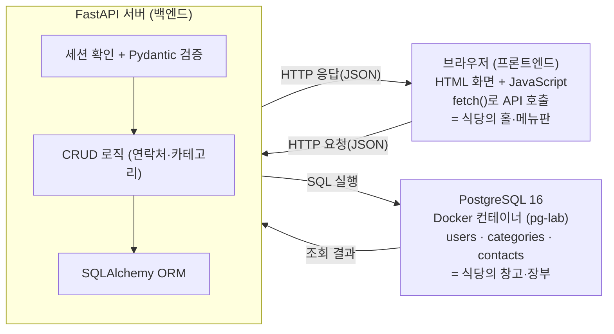
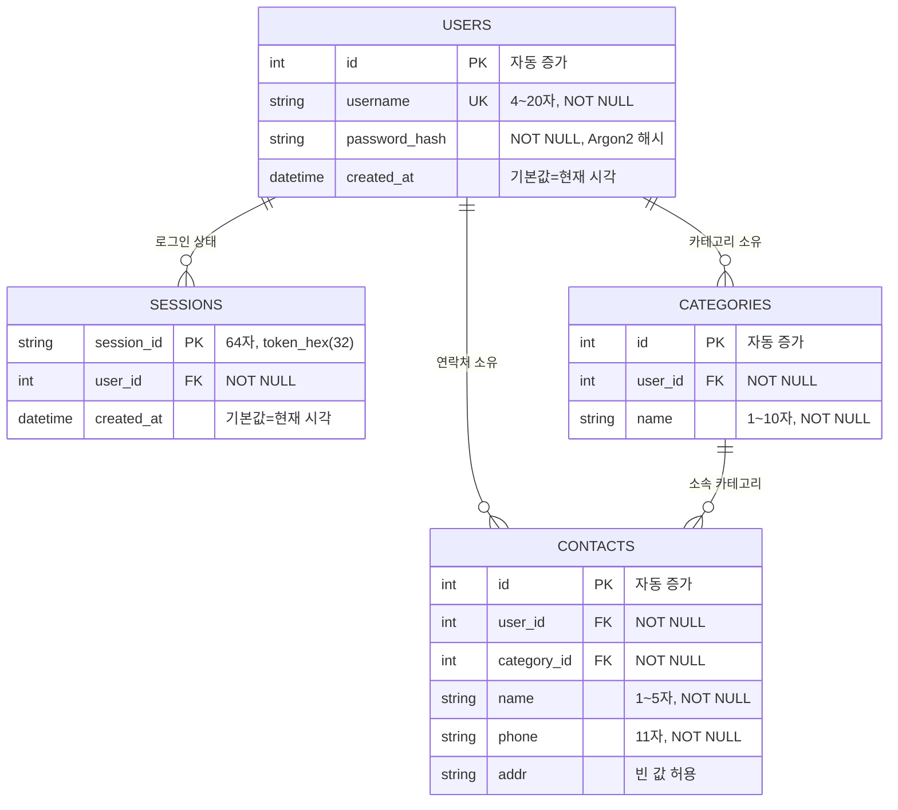
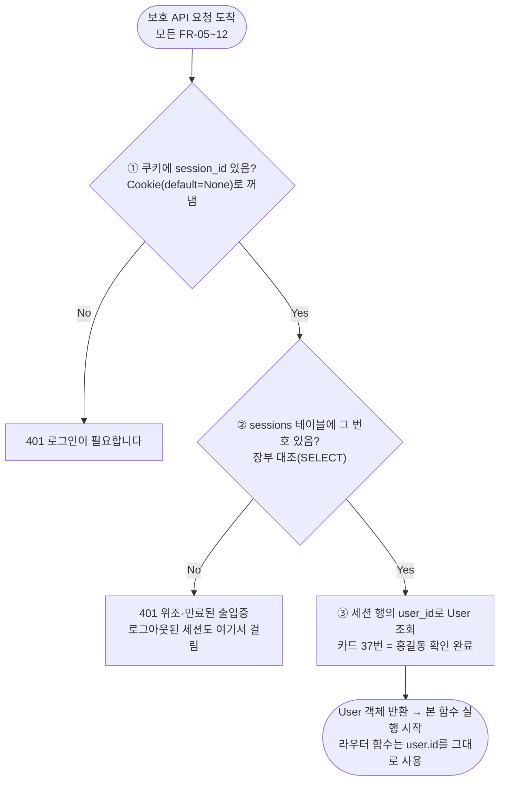
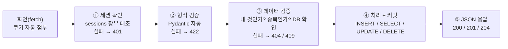
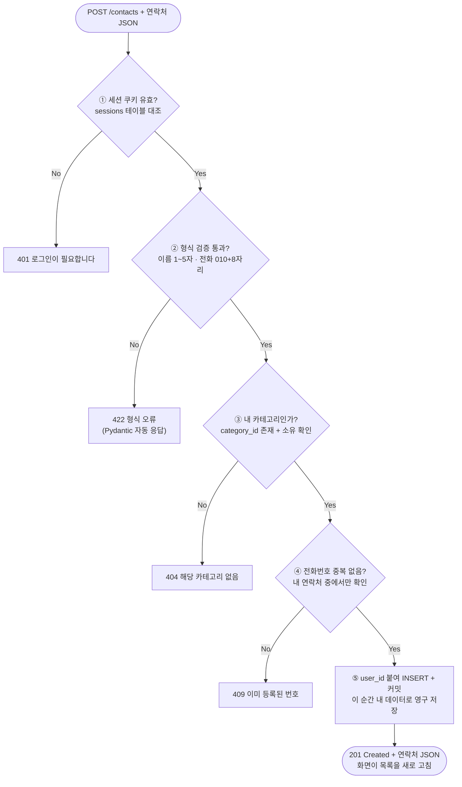
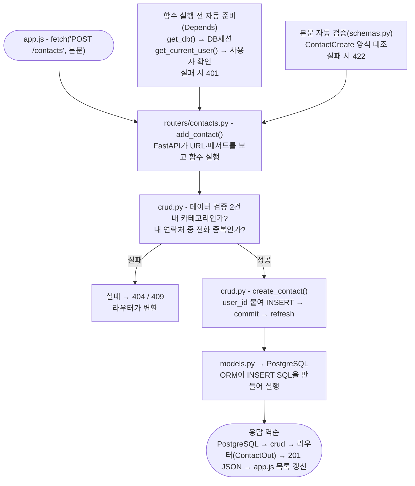
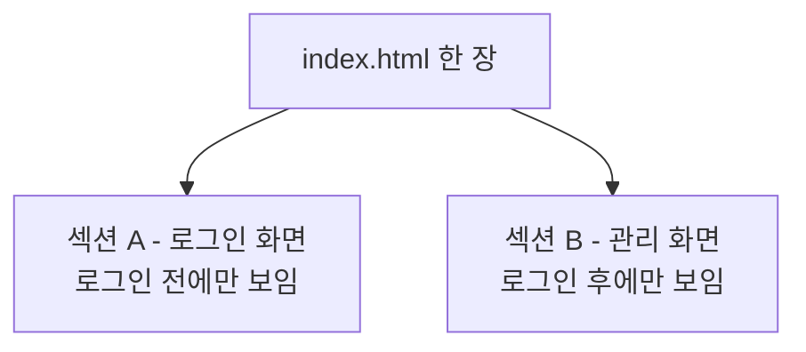
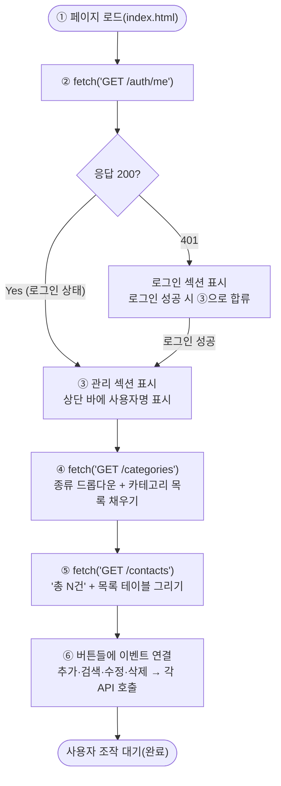

# 연락처 관리 웹 서비스 TRD v1.0

> **문서 유형:** Technical Requirements Document (TRD)  
> **과제 구분:** 2차 과제 - FastAPI + DB 연락처 프로그램  
> **기준 문서:** 아래 5개 확정(Baseline) 문서  
> - `00_연락처관리_웹서비스_과제목적_v1.0.pdf`
> - `01_연락처관리_웹서비스_구현요구사항_v1.0.pdf`
> - `02_연락처관리_웹서비스_화면정의서_v1.0.pdf`
> - `03_연락처관리_웹서비스_기능정의서_v1.0.pdf`
> - `04_연락처관리_웹서비스_PRD_v1.0.pdf`
>
> **작성 원칙:** 기준 문서에 명시된 내용만 정리한다. 문서에 없는 기술, API, 테이블, 필드, 검증 규칙, 예외 정책을 임의로 추가하지 않는다. 문서 간 상세 유효성·오류 규칙이 충돌하면 PRD §10의 제약에 따라 `01_구현요구사항`을 우선한다.

---

## 목차

1. [기술 스택 및 버전](#1-기술-스택-및-버전)
2. [시스템 아키텍처](#2-시스템-아키텍처)
3. [데이터 모델링(ERD)](#3-데이터-모델링erd)
4. [기능 요구사항](#4-기능-요구사항)
5. [데이터 검증(유효성 검사)](#5-데이터-검증유효성-검사)
6. [단계별 워크 플로우](#6-단계별-워크-플로우)
7. [에러/예외 처리](#7-에러예외-처리)
8. [테스트 시나리오](#8-테스트-시나리오)
9. [디렉터리 구조](#9-디렉터리-구조)
10. [구현 체크리스트](#10-구현-체크리스트)
11. [추가 고려사항](#11-추가-고려사항)

---

# 1. 기술 스택 및 버전

**출처:** `00_연락처관리_웹서비스_과제목적_v1.0.pdf` - 「검증된 기술 스택 버전 (실제 설치 확인)」

아래 조합은 기준 문서 작성일에 PyPI에서 실제로 함께 설치하여 버전 충돌이 없음을 확인한 조합이다.

| 구성요소 | 검증 버전 | 역할 |
|---|---|---|
| Python | 3.12.3 (검증 실행) / 3.14.x (최신 안정 라인) | 실행 환경 (FastAPI는 3.10+ 요구) |
| FastAPI | 0.139.0 | 웹 프레임워크 (API 서버) |
| Pydantic | 2.13.4 | 입력 데이터 자동 검증 |
| SQLAlchemy | 2.0.51 | ORM (파이썬 ↔ DB 연결) |
| psycopg | 3.3.4 | PostgreSQL 드라이버 |
| pwdlib[argon2] | 0.3.0 | 비밀번호 해싱 - Argon2 (FastAPI 공식 문서 권장) |
| Uvicorn | 0.50.0 | ASGI 웹 서버 |
| PostgreSQL | 16 (Docker) | 데이터베이스 |

### 인증 관련 기술 결정

- 인증 방식은 **세션 쿠키 로그인**을 사용한다.
- 세션 ID는 파이썬 표준 라이브러리 `secrets`의 `secrets.token_hex(32)`로 생성한다.
- 쿠키는 브라우저가 자동으로 보관·첨부한다.
- 비밀번호는 원문 저장을 금지하고 `pwdlib`의 Argon2 해시로 저장한다.
- JWT 방식은 이번 과제 범위가 아니며 향후 확장 항목이다.

---

# 2. 시스템 아키텍처

**출처:** `00_연락처관리_웹서비스_과제목적_v1.0.pdf` - 「4. 전체 아키텍처」



| 계층 | 담당 | 1차 과제에서의 대응물 |
|---|---|---|
| 프론트엔드 (브라우저) | 화면 표시, 입력 수집, API 호출 | `print()` 메뉴 + `input()` |
| 백엔드 (FastAPI) | 검증, CRUD 로직, 응답 생성 | `validate_*` + `add_member` 등 함수들 |
| 데이터베이스 (PostgreSQL) | 데이터 영구 보관, 무결성 보장 | 딕셔너리 + pickle 파일 |

> **문서 정합성 주의:** 위 Mermaid는 지정된 출처인 00 문서 §4의 그림을 그대로 구조화한 것이므로 DB 박스에 `users · categories · contacts`가 표시된다. 확정 데이터 모델은 01 문서 §1에 따라 `sessions`를 포함한 4개 테이블이며, 이는 다음 ERD와 세션 설계에 반영한다.

---

# 3. 데이터 모델링(ERD)

**출처:** `01_연락처관리_웹서비스_구현요구사항_v1.0.pdf` - 「1. 데이터 모델 (테이블 4개)」

## 3.1 데이터 모델 관계도



관계의 화살표는 모두 외래키(FK)이며, 행의 주인 또는 소속을 가리킨다.

- `sessions.user_id` → `users.id`
- `categories.user_id` → `users.id`
- `contacts.user_id` → `users.id`
- `contacts.category_id` → `categories.id`

## 3.2 테이블별 상세 정의

### users - 사용자(로그인 계정)

| 열 | 타입(개념) | 제약 | 설명 |
|---|---|---|---|
| id | 정수 (자동 증가) | PK | 사용자 고유 번호 |
| username | 문자열 4~20자 | UNIQUE, NOT NULL | 로그인 아이디 (영문 소문자·숫자만) |
| password_hash | 문자열 | NOT NULL | Argon2 해시 결과만 저장 (원문 저장 절대 금지) |
| created_at | 일시 | 기본값 = 현재 시각 | 가입 시각 |

### sessions - 로그인 장부

| 열 | 타입(개념) | 제약 | 설명 |
|---|---|---|---|
| session_id | 문자열 64자 | PK | `secrets.token_hex(32)`로 발급하는 무작위 번호 |
| user_id | 정수 | FK → users.id, NOT NULL | 이 세션의 주인 |
| created_at | 일시 | 기본값 = 현재 시각 | 로그인 시각 |

### categories - 연락처 종류

| 열 | 타입(개념) | 제약 | 설명 |
|---|---|---|---|
| id | 정수 (자동 증가) | PK | 카테고리 번호 |
| user_id | 정수 | FK → users.id, NOT NULL | 소유 사용자 (카테고리도 사용자별로 따로) |
| name | 문자열 1~10자 | NOT NULL | 카테고리 이름 |
| (테이블 제약) | - | UNIQUE(user_id, name) | 같은 사용자 안에서 이름 중복 금지 |

### contacts - 연락처 본체

| 열 | 타입(개념) | 제약 | 설명 |
|---|---|---|---|
| id | 정수 (자동 증가) | PK | 연락처 고유 번호 |
| user_id | 정수 | FK → users.id, NOT NULL | 이 연락처의 주인 |
| category_id | 정수 | FK → categories.id, NOT NULL | 소속 카테고리 |
| name | 문자열 1~5자 | NOT NULL | 이름 (1차 과제와 동일 규칙) |
| phone | 문자열 11자 | NOT NULL | 전화번호 (`010` + 숫자 8자리) |
| addr | 문자열 | 빈 값 허용 | 주소 (검증 없음) |
| (테이블 제약) | - | UNIQUE(user_id, phone) | 같은 사용자 안에서 전화번호 중복 금지 |

## 3.3 핵심 설계 결정

1. 연락처 식별자는 전화번호가 아니라 자동 증가 `id`를 사용한다.
2. 전화번호 중복 방지는 `UNIQUE(user_id, phone)`으로 유지한다.
3. 회원가입 성공 시 해당 사용자의 기본 카테고리 `가족 / 친구 / 기타` 3개를 자동 생성한다.
4. 동명이인은 각 연락처의 고유 `id`로 구분한다.

---

# 4. 기능 요구사항

**출처:**
- `01_연락처관리_웹서비스_구현요구사항_v1.0.pdf` - 「2. 기능 요구사항 목록(FR)」, 「3. 기능별 상세 명세」
- `03_연락처관리_웹서비스_기능정의서_v1.0.pdf` - 「2. 기능 목록」, 「4. 기능 상세 정의」

## 4.1 기능 요구사항 목록(FR)

| ID | 그룹 | 기능 | API | 필수 여부 |
|---|---|---|---|---|
| FR-01 | 인증 | 회원가입 | POST /auth/signup | 필수 |
| FR-02 | 인증 | 로그인 (세션 발급) | POST /auth/login | 필수 |
| FR-03 | 인증 | 로그아웃 (세션 삭제) | POST /auth/logout | 필수 |
| FR-04 | 인증 | 내 정보 확인 | GET /auth/me | 필수 |
| FR-05 | 연락처 | 연락처 추가 | POST /contacts | 필수 |
| FR-06 | 연락처 | 연락처 목록 조회 + 이름 검색 | GET /contacts | 필수 |
| FR-07 | 연락처 | 연락처 수정 (부분 수정) | PATCH /contacts/{id} | 필수 |
| FR-08 | 연락처 | 연락처 삭제 | DELETE /contacts/{id} | 필수 |
| FR-09 | 카테고리 | 카테고리 목록 조회 | GET /categories | 필수 |
| FR-10 | 카테고리 | 카테고리 추가 | POST /categories | 필수 |
| FR-11 | 카테고리 | 카테고리 이름 수정 | PATCH /categories/{id} | 필수 |
| FR-12 | 카테고리 | 카테고리 삭제 | DELETE /categories/{id} | 필수 |
| FR-13 | 화면 | 웹 화면 제공 (로그인/관리) | GET / | 필수 |

### 공통 규칙

- FR-05~FR-12는 로그인 필수다. 유효한 세션 쿠키가 없으면 401 응답한다.
- 모든 조회/수정/삭제는 자기 데이터만 대상으로 한다. 다른 사용자의 데이터는 id를 알아도 404로 응답한다.
- 잘못된 입력 또는 요청 때문에 서버가 500을 응답하면 안 된다.

## 4.2 기능별 상세 명세(FR)

### FR-01 회원가입 - POST /auth/signup

| 항목 | 내용 |
|---|---|
| 요청 본문 | `{"username": "yuun1103", "password": "pass1234"}` |
| 처리 | ① 형식 검증 → ② 아이디 중복 확인 → ③ 비밀번호 Argon2 해시 → ④ users 저장 → ⑤ 기본 카테고리 3개(가족/친구/기타) 자동 생성 |
| 성공 | 201 - `{"id": 1, "username": "yuun1103"}` |
| 실패 | 409 아이디 중복 / 422 형식 위반(4자 미만, 대문자 등) |

### FR-02 로그인 - POST /auth/login

| 항목 | 내용 |
|---|---|
| 요청 본문 | `{"username": "yuun1103", "password": "pass1234"}` |
| 처리 | ① 아이디로 사용자 조회 → ② 비밀번호를 해시와 대조(`verify`) → ③ `secrets.token_hex(32)`로 세션 번호 발급 → ④ sessions 기록 → ⑤ 응답에 `Set-Cookie: session_id=...` 포함 |
| 성공 | 200 - `{"message": "로그인 성공"}` + 세션 쿠키 |
| 실패 | 401 - `{"detail": "아이디 또는 비밀번호가 올바르지 않습니다"}` |

로그인 실패 시 아이디 존재 여부와 비밀번호 오류를 구분하지 않고 항상 같은 문구를 사용한다.

### FR-03 로그아웃 - POST /auth/logout

| 항목 | 내용 |
|---|---|
| 처리 | sessions에서 해당 세션 행 삭제 + 쿠키 삭제 지시 |
| 성공 | 200 - `{"message": "로그아웃 되었습니다"}` |

이미 로그아웃 상태여도 결과가 같으므로 200을 반환한다.

### FR-04 내 정보 확인 - GET /auth/me

| 항목 | 내용 |
|---|---|
| 용도 | 화면이 현재 로그인 여부와 로그인 사용자를 확인 |
| 성공 | 200 - `{"id": 1, "username": "yuun1103"}` |
| 실패 | 401 - 세션 없음/무효 |

### FR-05 연락처 추가 - POST /contacts

| 항목 | 내용 |
|---|---|
| 요청 본문 | `{"name": "윤아", "phone": "01012345678", "addr": "서울시", "category_id": 2}` |
| 처리 | ① 세션 확인 → ② 형식 검증 → ③ category_id가 내 카테고리인지 확인 → ④ 내 연락처 중 전화번호 중복 확인 → ⑤ user_id를 붙여 INSERT + 커밋 |
| 성공 | 201 - 생성된 연락처 JSON (`category_name` 포함) |
| 실패 | 401 미로그인 / 404 내 카테고리 아님·없음 / 409 전화번호 중복 / 422 형식 위반 |

성공 응답 예:

```json
{"id": 1, "name": "윤아", "phone": "01012345678", "addr": "서울시", "category_id": 2, "category_name": "친구"}
```

### FR-06 연락처 목록 조회 + 이름 검색 - GET /contacts

| 항목 | 내용 |
|---|---|
| 요청 | `GET /contacts` 또는 `GET /contacts?name=윤아` 또는 `GET /contacts?category_id=2` |
| 처리 | 내(user_id) 연락처만 조회. 검색어가 있으면 이름 일치 필터 추가 |
| 성공 | 200 - `{"total": 3, "items": [{...}, {...}, {...}]}` |

동명이인은 서로 다른 `id`를 가진 별도 행으로 함께 조회한다.

### FR-07 연락처 수정 - PATCH /contacts/{id}

| 항목 | 내용 |
|---|---|
| 요청 본문 | 바꿀 항목만 전송. 예: 주소만 수정 → `{"addr": "제주시"}` |
| 처리 | ① 세션 확인 → ② id가 내 연락처인지 확인 → ③ 보낸 항목만 형식 검증 후 갱신 → ④ phone 변경 시 중복 확인 → ⑤ category_id 변경 시 내 카테고리인지 확인 → ⑥ 커밋 |
| 성공 | 200 - 수정 완료된 연락처 전체 JSON |
| 실패 | 401 / 404 없는 id·남의 연락처 / 409 전화번호 중복 / 422 형식 위반 |

### FR-08 연락처 삭제 - DELETE /contacts/{id}

| 항목 | 내용 |
|---|---|
| 처리 | ① 세션 확인 → ② 내 연락처인지 확인 → ③ 삭제 + 커밋 |
| 성공 | 204 - 본문 없음 |
| 실패 | 401 / 404 없는 id·남의 연락처 |

### FR-09~FR-12 카테고리 CRUD

| FR | API | 요청 예 | 성공 | 실패 |
|---|---|---|---|---|
| FR-09 목록 | GET /categories | - | 200 `[ {"id":1,"name":"가족"}, {"id":2,"name":"친구"}, {"id":3,"name":"기타"} ]` | 401 |
| FR-10 추가 | POST /categories | `{"name": "동호회"}` | 201 `{"id":4,"name":"동호회"}` | 401 / 409 이름 중복 / 422 |
| FR-11 수정 | PATCH /categories/{id} | `{"name": "베프"}` | 200 수정된 카테고리 | 401 / 404 / 409 이름 중복 / 422 |
| FR-12 삭제 | DELETE /categories/{id} | - | 204 | 401 / 404 / 409 사용 중 |

카테고리에 속한 연락처가 1건이라도 있으면 삭제를 거부한다.

```json
{"detail": "이 카테고리를 사용하는 연락처가 2건 있어 삭제할 수 없습니다. 연락처의 종류를 먼저 변경하세요."}
```

### FR-13 화면 - GET /

| 항목 | 내용 |
|---|---|
| 처리 | HTML 화면 1장 제공 |
| 로그인 전 | 로그인/회원가입 폼 |
| 로그인 후 | 연락처·카테고리 관리 화면 |

## 4.3 기능 목록(Function Inventory)

| 기능 ID | 기능명 | 위치(파일) | 대표 함수/객체 | 관련 FR |
|---|---|---|---|---|
| FN-001 | DB 연결과 DB세션 공급 | database.py | `engine`, `get_db()` | 전체 |
| FN-002 | 테이블 모델 정의 | models.py | `User`, `LoginSession`, `Category`, `Contact` | §1 데이터 모델 |
| FN-003 | 입출력 양식 + 자동 검증 | schemas.py | `SignupIn`, `ContactCreate`, `ContactUpdate`, `ContactOut` 등 | 유효성 규칙 |
| FN-004 | 비밀번호 해싱/대조 | security.py | `hash_password()`, `verify_password()` | FR-01, FR-02 |
| FN-005 | 회원가입 처리 | crud.py + routers/auth.py | `create_user()` (+기본 카테고리 시드) | FR-01 |
| FN-006 | 로그인·세션 발급 | crud.py + routers/auth.py | `authenticate_user()`, `create_login_session()` | FR-02 |
| FN-007 | 현재 사용자 확인 (의존성) | routers/auth.py | `get_current_user()` | FR-04 + 모든 보호 API |
| FN-008 | 로그아웃·세션 삭제 | crud.py + routers/auth.py | `delete_login_session()` | FR-03 |
| FN-009 | 연락처 CRUD | crud.py | `list_contacts()`, `create_contact()`, `get_my_contact()`, `update_contact()`, `delete_contact()` | FR-05~08 |
| FN-010 | 카테고리 CRUD + 사용 중 확인 | crud.py | `list_categories()`, `create_category()`, `update_category()`, `delete_category()`, `count_contacts_in_category()` | FR-09~12 |
| FN-011 | 엔드포인트 정의 (창구) | routers/ 3개 파일 | `@router.get/post/patch/delete` 함수 12개 | FR-01~12 |
| FN-012 | 화면 제공 + 화면 동작 | main.py + static/ | `GET /` → index.html, app.js | FR-13 |
| FN-013 | 예외 → 상태 코드 변환 | routers/ 전반 | `HTTPException(status_code, detail)` | NFR-01 |

## 4.4 기능 상세 정의(FN)

### FN-001 DB 연결과 DB세션 공급 - database.py

| 항목 | 내용 |
|---|---|
| 구성 | `engine`, `SessionLocal`, `Base`, `get_db()` |
| get_db() 동작 | 요청마다 DB세션을 열어 빌려주고(`yield`), 요청 종료 시 반드시 닫음(`finally`) |
| 접속 문자열 | `postgresql+psycopg://`로 시작 (psycopg 3) |
| 1차 대응 | load_data / save_data의 저장소 연결 역할 |
| 예외 | DB(pg-lab)가 꺼져 있으면 연결 오류 → 실행 전 Docker 기동 확인 |

### FN-002 테이블 모델 정의 - models.py

| 항목 | 내용 |
|---|---|
| 클래스 | `User`, `LoginSession`, `Category`, `Contact` - 4개 테이블과 1:1 |
| 문법 | SQLAlchemy 2.0 방식 `Mapped[...]` + `mapped_column(...)` |
| 제약 표현 | `unique=True`, `ForeignKey(...)`, `UniqueConstraint("user_id", "phone")` |
| 출력 | 클래스 정의가 테이블 설계도이며 앱 시작 시 테이블 자동 생성 |

### FN-003 입출력 양식 + 자동 검증 - schemas.py

| 스키마 | 용도 | 담는 규칙 |
|---|---|---|
| SignupIn | 가입/로그인 입력 | username 4~20자·`^[a-z0-9]+$` / password 4~20자 |
| UserOut | 사용자 응답 | id, username만 - password_hash 제외 |
| ContactCreate | 연락처 추가 입력 | name 1~5자 / phone `^010\d{8}$` / addr 자유 / category_id |
| ContactUpdate | 연락처 수정 입력 | 같은 규칙, 모든 필드 선택(`None`) - 보낸 것만 수정 |
| ContactOut | 연락처 응답 | id, name, phone, addr, category_id, category_name |
| ContactListOut | 목록 응답 | total, items(ContactOut 배열) |
| CategoryCreate/Update | 카테고리 입력 | name 1~10자 |
| CategoryOut | 카테고리 응답 | id, name |

입력용과 출력용 스키마를 분리한다. 입력에 id를 받지 않고, 출력에 password_hash를 노출하지 않는다.

### FN-004 비밀번호 해싱/대조 - security.py

| 함수 | 입력 | 출력 | 설명 |
|---|---|---|---|
| `hash_password(원문)` | 비밀번호 원문 | 해시 문자열 | pwdlib(Argon2)로 변환 - 가입 시 1회 |
| `verify_password(원문, 해시)` | 로그인 입력값, 저장된 해시 | True/False | 로그인 때마다 대조 |

### FN-005 회원가입 처리 - crud.py `create_user`

1. username 중복 확인(있으면 라우터가 409)
2. `hash_password`로 해시
3. User INSERT
4. 같은 커밋 안에서 기본 카테고리 3개(가족/친구/기타) INSERT
5. commit

사용자 생성과 기본 카테고리 생성을 같은 트랜잭션으로 묶어 둘 다 성공하거나 둘 다 실패하도록 한다.

### FN-006 로그인·세션 발급 - crud.py + routers/auth.py

| 함수/단계 | 처리 |
|---|---|
| `authenticate_user(db, username, password)` | 사용자 조회 → `verify_password` 대조 → 성공 시 User, 실패 시 None |
| `create_login_session(db, user_id)` | `secrets.token_hex(32)`로 세션 번호 생성 → sessions INSERT + commit → 번호 반환 |
| 라우터 마무리 | `response.set_cookie("session_id", 번호, httponly=True)` |

### FN-007 현재 사용자 확인 - `get_current_user()`



| 항목 | 내용 |
|---|---|
| 시그니처 | `get_current_user(session_id: str | None = Cookie(default=None), db: Session = Depends(get_db)) -> User` |
| 사용법 | 보호할 라우터 함수에 `user: models.User = Depends(get_current_user)` 한 줄 추가 |
| 역할 | FR-05~12 보호 API의 공통 문지기 |

### FN-008 로그아웃 - crud.py `delete_login_session`

| 항목 | 내용 |
|---|---|
| 처리 | sessions에서 해당 행 DELETE + commit → 라우터가 `response.delete_cookie("session_id")` |
| 결과 | 같은 쿠키로 재요청하면 FN-007에서 401 |

### FN-009 연락처 CRUD - crud.py

모든 함수의 첫 번째 규칙은 조회 조건에 `user_id`가 반드시 들어가는 것이다.

| 함수 | 입력 | 처리 | 출력 |
|---|---|---|---|
| `list_contacts(db, user_id, name=None, category_id=None)` | 검색어(선택) | 내 연락처 SELECT (+이름/카테고리 필터) | Contact 리스트 |
| `get_my_contact(db, user_id, contact_id)` | 대상 id | `WHERE id=? AND user_id=?`로 조회 | Contact 또는 None(→404) |
| `create_contact(db, user_id, data)` | ContactCreate | user_id 붙여 INSERT + commit + refresh | 생성된 Contact |
| `update_contact(db, contact, data)` | 대상 + ContactUpdate | `model_dump(exclude_unset=True)`로 보낸 항목만 갱신 + commit | 수정된 Contact |
| `delete_contact(db, contact)` | 대상 | DELETE + commit | 없음 |

### FN-010 카테고리 CRUD - crud.py

연락처 CRUD와 같은 패턴을 사용하며 삭제 전 사용 중 확인 함수가 추가된다.

| 함수 | 역할 |
|---|---|
| `count_contacts_in_category(db, user_id, category_id)` | 해당 카테고리 소속 연락처 수를 계산. 삭제 전 필수 호출, 1건 이상이면 라우터가 409(건수를 detail에 포함) |

### FN-011 엔드포인트 정의 - routers/ 3개 파일

라우터 함수는 **접수 → 확인 → CRUD 호출 → 응답 포장**만 한다.

```python
@router.post("", response_model=schemas.ContactOut, status_code=201)
def add_contact(
    data: schemas.ContactCreate,
    user: models.User = Depends(get_current_user),
    db: Session = Depends(get_db),
):
    ...  # 데이터 검증(404/409) 후 crud 호출, 결과 반환
```

| 파일 | 담는 창구 | 개수 |
|---|---|---:|
| routers/auth.py | signup, login, logout, me | 4 |
| routers/contacts.py | 목록/검색, 추가, 수정, 삭제 | 4 |
| routers/categories.py | 목록, 추가, 수정, 삭제 | 4 |

### FN-012 화면 제공 + 화면 동작 - main.py + static/

| 항목 | 내용 |
|---|---|
| main.py | FastAPI 앱 생성, 라우터 3개 등록, GET / → index.html 반환 |
| index.html | 02 문서의 SCR-001~003 구조 |
| app.js | 페이지 로드 워크플로우(me → categories → contacts) 구현 + 버튼 이벤트 |

### FN-013 예외 → 상태 코드 변환 - 라우터 전반

| 상황 | 코드 패턴 | 결과 |
|---|---|---|
| crud가 None 반환(없거나 남의 것) | `raise HTTPException(404, "해당 연락처가 없습니다")` | 404 + detail |
| 중복 발견 | `raise HTTPException(409, "이미 등록된 전화번호입니다")` | 409 + detail |
| 사용 중 카테고리 삭제 | `raise HTTPException(409, f"...연락처가 {n}건 있어 삭제할 수 없습니다...")` | 409 + detail |
| 형식 위반 | 코드 없음 - Pydantic 자동 | 422 |
| 미로그인 | 코드 없음 - FN-007 처리 | 401 |

---

# 5. 데이터 검증(유효성 검사)

**출처:** `01_연락처관리_웹서비스_구현요구사항_v1.0.pdf` - 「4. 유효성 검사 규칙」

## 5.1 규칙표

| 대상 | 규칙 | 통과 예 | 실패 예 (→ 422) |
|---|---|---|---|
| 아이디(username) | 4~20자, 영문 소문자·숫자만 (`^[a-z0-9]+$`) | yuun1103 | abc(3자), YUun1103(대문자) |
| 비밀번호(password) | 4~20자 | pass1234 | abc(3자) |
| 이름(name) | 1~5자 | 윤아, 가나다라마 | 빈 값, 가나다라마바(6자) |
| 전화번호(phone) | `^010\d{8}$` - 010 + 숫자 8자리 | 01012345678 | 123, 010-1234-5678, 010abcdefgh, 01112345678 |
| 주소(addr) | 검증 없음 (빈 값 허용) | 서울시, 빈 값 | - |
| 카테고리명(name) | 1~10자 | 동호회 | 빈 값, 11자 이상 |

전화번호는 **하이픈 없는 11자리** 형식으로 확정한다. 하이픈 포함 입력은 422로 거부한다.

## 5.2 검증의 2계층 구조

| 계층 | 무엇을 검사하나 | 담당 | 실패 시 | 예 |
|---|---|---|---|---|
| ① 형식 검증 | 입력 자체만 보고 판단 가능한 규칙 | Pydantic 자동 | 422 | 이름 6자, 전화번호 형식, 빈 값 |
| ② 데이터 검증 | DB 조회가 필요한 규칙 | 직접 코드 작성 | 404 / 409 | 전화번호 중복, 없는 카테고리, 사용 중 카테고리 |

---

# 6. 단계별 워크 플로우

**출처:** `01_연락처관리_웹서비스_구현요구사항_v1.0.pdf` - 「8. 전체 워크플로우」, 「9. 단계별 워크플로우」

## 6.1 모든 요청의 공통 처리 파이프라인

FR-05~FR-12의 요청은 동일한 5단계 파이프라인을 지난다.



- ①은 로그인 필수 API(FR-05~12)에 적용한다.
- ②는 본문이 있는 요청(POST/PATCH)에 적용한다.
- 어느 단계에서 실패해도 이후 단계는 실행하지 않고 즉시 오류 응답한다.

## 6.2 대표 예: 연락처 추가(FR-05)



2차 과제에서는 서버에 재입력 루프가 없다. 서버는 실패 지점의 오류 코드만 반환하고, 다시 입력받는 일은 브라우저 화면이 담당한다.

## 6.3 요청 1건의 함수 호출 관계

**보조 출처:** `03_연락처관리_웹서비스_기능정의서_v1.0.pdf` - 「3. 전체 워크플로우」



---

# 7. 에러/예외 처리

**출처:** `01_연락처관리_웹서비스_구현요구사항_v1.0.pdf` - 「5. 예외 처리 요구사항」

## 7.1 상태 코드 매트릭스

| 코드 | 의미 | 발생 상황 |
|---|---|---|
| 401 | 로그인 필요 / 인증 실패 | 세션 쿠키 없음·무효, 로그인 시 아이디/비밀번호 불일치 |
| 404 | 대상 없음 | 없는 id 접근, 남의 데이터 id 접근, 없는 카테고리 지정 |
| 409 | 규칙 충돌 | 아이디 중복, 내 연락처의 전화번호 중복, 내 카테고리 이름 중복, 사용 중 카테고리 삭제 |
| 422 | 형식 위반 | 유효성 규칙 위반 (Pydantic 자동) |
| 500 | 서버 내부 오류 | 발생하면 안 됨. 발생 시 예외 처리 누락 |

## 7.2 반드시 지킬 원칙

1. 남의 데이터는 403이 아니라 404로 응답한다.
2. 모든 오류 응답은 다음 형태로 통일한다.

```json
{"detail": "사람이 읽을 수 있는 한국어 안내"}
```

## 7.3 놓치기 쉬운 비정상 상황

| 구분 | 상황 | 요구 동작 |
|---|---|---|
| 인증 | 로그인 없이 데이터 API 호출 | 401 + 안내, 화면은 로그인 폼 표시 |
| 인증 | 서버 재시작 후 이전 쿠키로 접근 | sessions 테이블에 있으므로 정상 동작 |
| 인증 | 존재하지 않는 세션 번호를 쿠키로 보냄 | 401 |
| 검색 | 검색 결과 0건 | 200 + `{"total": 0, "items": []}` - 오류 아님 |
| 선택 | 없는 id / 남의 id로 수정·삭제 | 404 |
| 입력 | 숫자가 와야 할 자리에 문자(`/contacts/abc`) | FastAPI 타입 힌트가 자동으로 422 처리 |
| 입력 | JSON이 깨진 요청 | FastAPI가 자동으로 422 처리 |
| DB | DB 컨테이너(pg-lab)가 꺼져 있음 | 서버 시작/요청 시 연결 오류 - 실행 전 Docker 확인 절차를 README에 명시 |

---

# 8. 테스트 시나리오

**출처:** `03_연락처관리_웹서비스_기능정의서_v1.0.pdf` - 「6. 기능 점검 체크리스트」

| 관련 기능 | 테스트 시나리오 | 기대 결과 |
|---|---|---|
| FN-001 | pg-lab이 켜진 상태에서 서버 시작 | 오류 없이 시작 |
| FN-002 | DB 테이블 생성 확인 | users·sessions·categories·contacts 4개 생성 |
| FN-005 | 신규 사용자 가입 | 가입 직후 해당 사용자의 카테고리가 정확히 3개(가족/친구/기타) |
| FN-006 | 로그인 | 응답에 Set-Cookie가 있고 이후 요청에 쿠키 자동 첨부 |
| FN-007 | 쿠키 없음/엉터리 쿠키로 보호 API 호출 | 401 |
| FN-008 | 로그아웃 후 같은 쿠키로 요청 | 401 |
| FN-009 | 계정 2개로 데이터 격리 확인 | 서로의 연락처가 보이지 않고 남의 id 접근 시 404 |
| FN-009 | 같은 번호 두 번 추가 + 부분 수정 | 중복 추가 409, PATCH는 보낸 항목만 변경 |
| FN-010 | 사용 중 카테고리 삭제 | 409 + 소속 연락처 건수 안내 |
| FN-011 | Swagger UI 확인 | `/docs`에 창구 12개가 모두 보이고 실행 가능 |
| FN-012 | 브라우저 전체 기능 확인 | 로그인부터 관리까지 전 기능 동작 |
| FN-013 | 예외 상황 전체 수행 | 어떤 요청에도 500이 발생하지 않음 |

---

# 9. 디렉터리 구조

**출처:** `03_연락처관리_웹서비스_기능정의서_v1.0.pdf` - 「1-1. 폴더/파일 구성」

```text
contact_app/
├── main.py                  # 앱 조립: FastAPI 생성, 라우터 등록, 화면 제공
├── database.py              # DB 연결: 엔진, DB세션 공장, get_db
├── models.py                # 테이블 정의: User, LoginSession, Category, Contact
├── schemas.py               # 입출력 양식: Pydantic 모델 (검증 규칙의 집)
├── security.py              # 비밀번호 해싱: hash_password, verify_password
├── crud.py                  # DB 작업 함수: 조회/생성/수정/삭제 (핵심 로직)
├── routers/
│   ├── auth.py              # 인증 엔드포인트 4개 + get_current_user 의존성
│   ├── contacts.py          # 연락처 엔드포인트 4개
│   └── categories.py        # 카테고리 엔드포인트 4개
└── static/
    ├── index.html           # 화면 (02 문서의 SCR-001~003)
    └── app.js               # 화면 동작 (fetch 호출, DOM 갱신)
```

### 계층 분리 원칙

- `routers`: URL·메서드·상태 코드 결정. 라우터에 DB 코드 금지.
- `crud`: 실제 DB 조회·생성·수정·삭제. crud에서 상태 코드 결정 금지.
- `models.py` + `database.py`: 테이블 정의와 DB 연결.
- `schemas.py`: 입력 검증과 응답 양식.

---

# 10. 구현 체크리스트

**출처:**
- `03_연락처관리_웹서비스_기능정의서_v1.0.pdf` - 「6. 기능 점검 체크리스트」
- `04_연락처관리_웹서비스_PRD_v1.0.pdf` - 「9. 인수 기준 (Acceptance Criteria)」

## 10.1 기능 구현 체크리스트(FN)

- [ ] FN-001: pg-lab이 켜진 상태에서 서버가 오류 없이 시작
- [ ] FN-002: users·sessions·categories·contacts 테이블 4개 생성 확인
- [ ] FN-005: 가입 직후 그 사용자의 카테고리가 정확히 3개(가족/친구/기타)
- [ ] FN-006: 로그인 응답에 Set-Cookie가 있고, 이후 요청에 쿠키가 자동 첨부됨
- [ ] FN-007: 쿠키 없이/엉터리 쿠키로 보호 API 호출 시 401
- [ ] FN-008: 로그아웃 후 같은 쿠키로 요청 시 401
- [ ] FN-009: 계정 2개로 서로의 연락처가 보이지 않음 + 남의 id 접근 시 404
- [ ] FN-009: 같은 번호 두 번 추가 시 409, PATCH는 보낸 항목만 바뀜
- [ ] FN-010: 소속 연락처가 있는 카테고리 삭제 시 409 + 건수 안내
- [ ] FN-011: /docs에 창구 12개가 전부 보이고 실행 가능
- [ ] FN-012: 브라우저 화면에서 로그인부터 관리까지 전 기능 동작
- [ ] FN-013: 어떤 요청에도 500이 나지 않음

## 10.2 인수 기준(AC)

모든 항목은 계정 2개(A, B)를 만들어 검사한다.

- [ ] AC-01: 가입 성공 직후 로그인하면, 종류 드롭다운에 가족/친구/기타 3개가 이미 있다
- [ ] AC-02: 이미 있는 아이디로 가입하면 거부되고 이유가 표시된다
- [ ] AC-03: 로그인 없이 접속하면 관리 화면이 아닌 로그인 화면이 보인다
- [ ] AC-04: 틀린 비밀번호로 로그인하면 실패 안내가 뜨고, 아이디 존재 여부는 알 수 없는 문구다
- [ ] AC-05: 연락처를 추가하면 목록에 바로 보이고 "총 N건"이 +1 된다
- [ ] AC-06: 이름 6자, 전화번호에 하이픈/문자, 빈 값은 전부 거부되고 항목별 이유가 표시된다
- [ ] AC-07: 같은 전화번호를 두 번 추가하면 거부된다 - 단, B는 A와 같은 번호를 저장할 수 있다
- [ ] AC-08: "윤아"로 검색하면 동명이인 2건이 모두 나오고, 그중 1건만 정확히 수정/삭제할 수 있다
- [ ] AC-09: 수정에서 주소만 바꾸면 나머지 항목은 그대로다
- [ ] AC-10: 새 종류(예: 동호회)를 추가하면 드롭다운에 바로 나타난다 - 단, B의 드롭다운에는 없다
- [ ] AC-11: 종류 이름을 바꾸면(친구→베프) 그 종류였던 연락처들의 표기가 함께 바뀐다
- [ ] AC-12: 연락처가 소속된 종류를 삭제하면 거부되고 "몇 건 때문인지"가 안내된다
- [ ] AC-13: A로 로그인한 브라우저에서 B의 연락처는 목록·검색 어디에도 나오지 않는다
- [ ] AC-14: B가 A의 연락처 id를 알아내 직접 요청해도 "없음"으로 처리된다 (`/docs`에서 검사)
- [ ] AC-15: 로그아웃하면 즉시 관리 화면을 쓸 수 없고, 다시 로그인해야 한다
- [ ] AC-16: 서버를 껐다 켜도(재시작) 데이터가 그대로고, 브라우저를 닫았다 열어도 로그인이 유지된다
- [ ] AC-17: 위의 어떤 거부 상황에서도 서비스가 죽거나 빈 화면이 되지 않는다

---

# 11. 추가 고려사항

5개 기준 문서 전체에서 구현 시 놓치기 쉬운 사항을 정리한다.

## 11.1 세션(Session) - 반드시 두 개념을 구분

**출처:** `03_기능정의서` §1-3, FN-006~FN-008 / `01_구현요구사항` §1, §6

| 구분 | 정체 | 코드에서의 이름 |
|---|---|---|
| DB 세션 | 파이썬 ↔ DB 사이의 대화 연결. 요청마다 열고 닫음 | `Session`, `db: Session = Depends(get_db)` |
| 로그인 세션 | 누가 로그인 중인지 기록한 `sessions` 테이블의 행 | 모델 클래스 `LoginSession` |

- 이름 충돌 방지를 위해 로그인 세션 모델 클래스는 `Session`이 아니라 `LoginSession`으로 정한다.
- 로그인 시 `secrets.token_hex(32)`로 세션 번호를 만들고 `sessions`에 저장한다.
- 응답은 `session_id` 쿠키를 설정하며 `httponly=True`를 사용한다.
- 보호 API는 `get_current_user()` 의존성으로 쿠키와 sessions 테이블을 대조한다.
- 로그아웃은 sessions 행을 삭제하고 쿠키 삭제를 지시한다.
- 현재 설계는 세션 만료 시간이 없으며 로그아웃 전까지 유지한다. 만료 시간은 향후 확장 항목이다.

## 11.2 저장·영속화와 트랜잭션

**출처:** `01_구현요구사항` §6 / `04_PRD` G4, AC-16

| 항목 | 요구사항 |
|---|---|
| 저장소 | PostgreSQL 16 (Docker 컨테이너 pg-lab) |
| 저장 시점 | 각 요청 처리 성공 시 즉시 커밋 |
| 실패 시 | 처리 도중 오류가 나면 롤백 - 반쪽짜리 데이터가 남지 않음 |
| 로그인 상태 | sessions도 테이블이므로 서버 재시작 후에도 로그인 유지 |
| 확인 | 서버 재시작 후 재접속해 데이터·로그인 유지 확인 / psql로 SELECT 확인 |

회원가입의 User 생성과 기본 카테고리 3개 생성은 같은 트랜잭션에서 처리한다.

## 11.3 비기능 요구사항(NFR)

**출처:** `01_구현요구사항` §7

| ID | 요구사항 |
|---|---|
| NFR-01 | 어떤 요청에도 서버가 500을 응답하지 않을 것 (모든 예외를 의미 있는 상태 코드로 변환) |
| NFR-02 | 계층별 파일 분리: 라우터 / CRUD / 모델 / 스키마 (한 파일 덩어리 금지) |
| NFR-03 | 비밀번호는 Argon2 해시로만 저장 (원문·복호화 가능 형태 저장 금지) |
| NFR-04 | 데이터 API(FR-05~12) 전부 로그인 필수 + user_id 격리 (예외 없음) |
| NFR-05 | 한글 입출력이 깨지지 않을 것 (UTF-8) |
| NFR-06 | 자동 API 문서(`/docs`)가 항상 열리고, 문서만 보고 API를 테스트할 수 있을 것 |

## 11.4 화면 구성 및 공통 규칙

**출처:** `02_화면정의서` §1, §3, §5, §8

### 한 페이지, 두 개의 섹션



어느 섹션을 보여줄지는 `GET /auth/me`의 응답이 결정한다.

### 페이지 로드부터 목록 표시까지



카테고리 목록(④)을 연락처 목록(⑤)보다 먼저 불러야 연락처 추가 폼의 종류 드롭다운을 채울 수 있다.

### 화면 공통 규칙

- 모든 입력창에 `placeholder`로 형식 예시를 제공한다.
- 추가/수정/삭제 성공 시 관련 목록을 즉시 새로 고침한다.
- 삭제는 반드시 `confirm` 확인 대화상자를 거친다.
- 401/404/409/422 응답에도 화면이 멈추지 않고 메시지를 표시한다.
- `<meta charset="UTF-8">`을 명시한다.
- 요청 진행 중에는 버튼을 비활성화하여 이중 제출을 막는다.
- 404/409/422 오류는 서버의 `detail`을 그대로 표시한다.
- 로그인 시도 자체의 401을 제외한 401 응답은 세션 만료로 보고 로그인 섹션으로 전환한다.
- Pydantic 자동 422의 `detail`이 배열이면 첫 항목의 `msg`를 표시한다.

## 11.5 Swagger UI 검증 흐름

**출처:** `02_화면정의서` §7

1. `http://127.0.0.1:8000/docs` 접속
2. POST `/auth/signup` 실행 → 201 확인
3. POST `/auth/login` 실행 → 200 확인, 브라우저에 세션 쿠키 저장
4. GET `/contacts` 등 보호 API 실행 → 쿠키 자동 첨부 확인
5. POST `/auth/logout` 실행 후 보호 API 재실행 → 401 확인

## 11.6 가정·제약 및 범위

**출처:** `04_PRD` §2-2, §10, §11

### 가정 및 제약

| 구분 | 내용 |
|---|---|
| 가정 | 데이터 양은 사용자당 수십~수백 건 수준 (페이지 나눔 불필요) |
| 가정 | 사용자는 PC 브라우저로 접속 (모바일 최적화 없음) |
| 가정 | 로컬 개발 환경에서 학습자 본인이 사용자 A·B 역할을 모두 수행하며 검증 |
| 제약 | 언어는 Python, 화면은 HTML/JavaScript, DB는 PostgreSQL 16(Docker) |
| 제약 | 연락처 항목은 이름/전화/주소/종류 4개로 한정 |
| 제약 | 상세 유효성·오류 규칙은 01 문서를 단일 기준으로 따름 (문서 간 충돌 시 01 우선) |

### 이번 범위에서 만들지 않는 것

- 비밀번호 찾기/변경, 이메일 인증
- 회원 간 연락처 공유, 관리자 기능
- 모바일 앱, 반응형 최적화
- 실서버 배포, HTTPS
- 사진·생일 등 추가 항목

### 향후 확장

- 비밀번호 변경/찾기
- 세션 만료 시간
- JWT 토큰 방식
- 연락처 항목 확장(사진·생일·메모)
- 페이지 나눔(pagination)·정렬
- CSV 가져오기/내보내기
- 배포(서버용 실행, 컨테이너화, HTTPS)

## 11.7 문서 간 정합성 처리 결과

5개 문서를 상호 비교해 다음 기준으로 정리했다.

1. **테이블 수:** 00 문서의 일부 개요와 §4 아키텍처 그림은 `users·categories·contacts` 3개를 표시하지만, 01 문서의 확정 데이터 모델과 03 문서 체크리스트는 `sessions`를 포함한 4개 테이블을 요구한다. 따라서 §2의 아키텍처 그림은 지정 출처를 그대로 반영하고, 실제 데이터 모델·인증·테스트는 4개 테이블 기준으로 정리했다.
2. **빈 값 검증:** PRD AC-06은 "빈 값" 거부를 넓게 표현하지만, PRD §10은 상세 유효성 규칙의 단일 기준을 01 문서로 지정한다. 따라서 `addr`는 01 §4-1에 따라 빈 값을 허용하고, 필수 입력 필드의 빈 값은 각 규칙에 따라 거부한다.

---

# 문서 검증 기준

이 TRD는 다음 항목을 기준으로 원문과 대조한다.

- 기술 스택 8개와 버전이 00 문서의 검증 표와 일치하는가
- 시스템 아키텍처의 계층·책임·데이터 흐름이 00 문서 §4와 일치하는가
- ERD가 users/sessions/categories/contacts 4개 테이블과 FK·UNIQUE 제약을 포함하는가
- FR-01~FR-13의 기능·HTTP 메서드·경로가 일치하는가
- FN-001~FN-013의 파일·대표 함수·역할이 일치하는가
- 유효성 규칙이 01 문서 §4-1과 일치하는가
- 401/404/409/422/500 정책이 01 문서 §5와 일치하는가
- 공통 5단계 파이프라인과 FR-05 흐름이 01 문서 §8~9와 일치하는가
- 테스트 시나리오가 03 문서 기능 점검 체크리스트 12개 항목을 모두 포함하는가
- 구현 체크리스트가 FN 체크리스트 12개와 AC-01~AC-17을 모두 포함하는가
- 디렉터리 구조가 03 문서 §1-1과 일치하는가
- Session 관련 요구가 데이터 모델·기능·추가 고려사항에 모두 반영되어 있는가
